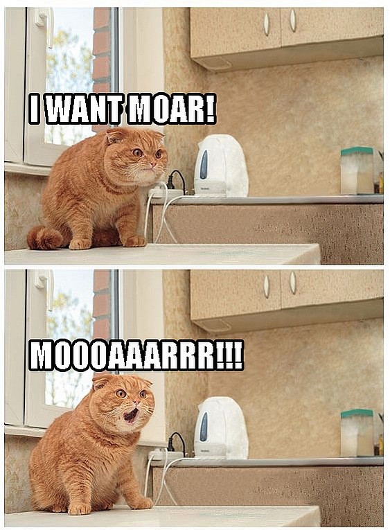

# Humble GitHub _on Tuesday, December 1st_
By [Matt Brender](https://twitter.com/mjbrender)

Complete **all three** of the following tasks to level up your skills.

### Challenge A: Fork a Repository

* Head over to the [Transparent Travel project](https://github.com/mjbrender/transparent-travel)
* Click the Fork button in the top right corner
* Copy this repository locally

### Challenge B: Mess with Markdown

* Use markdown to edit your local copy of this repository. I'd love for you to offer a conference you'd like me to speak at :smile:
* Review [GitHub Flavored Markdown](https://help.github.com/articles/github-flavored-markdown/) and don't be scared to use [the full spectrum of emojis](http://www.emoji-cheat-sheet.com) :grin: :neckbeard:
* Once you edit, add these files to your local copy of the repository as a commit
* Once you've committed the edits locally, push it to your remote repository on GitHub

### Challenge C: Open a Pull Request

* Go back to your copy of this repository on GitHub: https://github.com/ > click Repositories
* Click New Pull Request
* Click "Compare across forks"
* Choose mjbrender/transparent-travel as the **base** and compare it to your repository. Be sure to choose whatever branch you chose to edit in
* Click "Create pull request"
* I'll get a notification, and will comment on it. I'll response with notes for improvements, which you can add on your branch and it will update the pull request. Once we're ready to merge, I'll write LGTM (for Looks Good to Me) and then merge it in!

### GIVE ME MOAR

Here are references I've found crucial to getting good at the basics:

* [GitHub Flavored Markdown](https://help.github.com/articles/github-flavored-markdown/)
* [the full spectrum of emojis](http://www.emoji-cheat-sheet.com)
* [Mastering Markdown](https://guides.github.com/features/mastering-markdown/)
* [Git fu command line](http://www.raywenderlich.com/74258/git-tutorial-intermediate)
* [How to do an Interactive Rebase by Chris Wahl](http://wahlnetwork.com/2015/07/02/interactive-rebase/)j
* [Avoiding Git Disaster](http://randyfay.com/content/avoiding-git-disasters-gory-story)

Others:
* Great read - http://gitbookio.gitbooks.io/markdown/content/about/README.html
* Great practice - http://markdowntutorial.com/lesson/1/
* Great reference - http://daringfireball.net/projects/markdown/basics
* My blog posts on git - http://neckbeardinfluence.com/tag/git/
